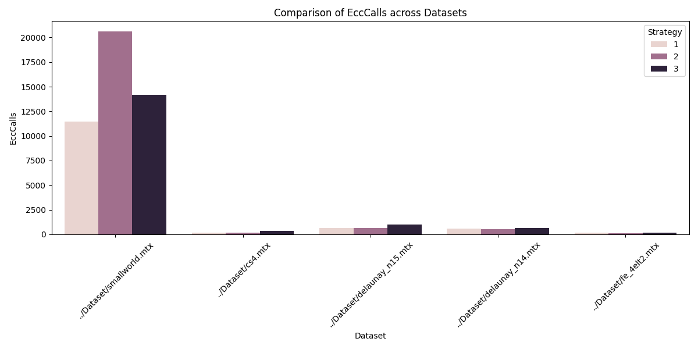
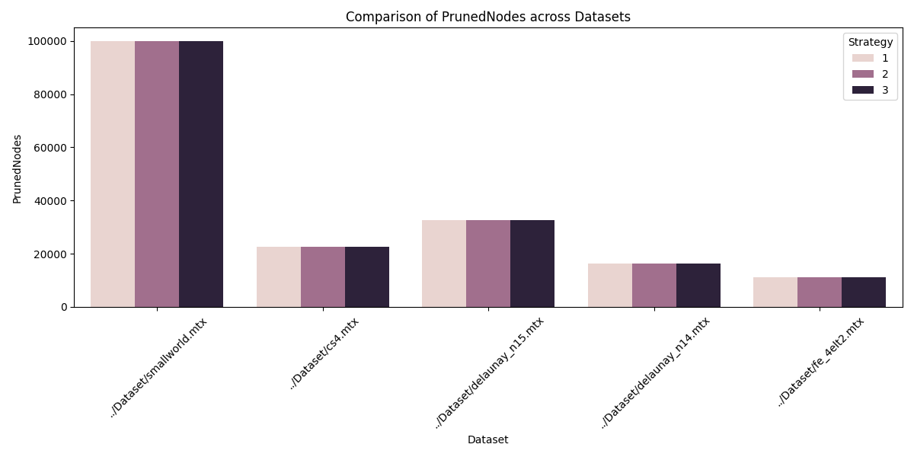

# Report

Eshaan Sharma, Aditya Daseri 

---

## 1. Problem Statement

In this project, I address the challenge of computing the **diameter** ∆(G) of an undirected graph G(V,E)—that is, the longest shortest‐path between any two vertices.  A naïve all‐pairs shortest‐paths approach requires O(n·m) time on sparse graphs (or O(n³) in dense cases), which quickly becomes infeasible for **small‐world networks** with millions of nodes and hundreds of millions of edges .

Small‐world graphs, such as social networks or web graphs, typically exhibit:

* **Sparsity**: m ≪ n(n−1)/2
* **Low average distance**: average shortest‐path length ∼ O(log n)
* **Skewed degree distribution**: a few high‐degree hubs and many low‐degree vertices

Yet the exact diameter is crucial for understanding worst‐case communication delay, network resilience, and extremal path structure.

---

## 2. The BoundingDiameters Algorithm

Rather than computing every node’s eccentricity via full APSP, I implemented **BoundingDiameters**, which maintains **lower** and **upper** bounds on both per-vertex eccentricities ε(v) and the global diameter ∆:

* For each v:

  $$
    ε_L[v] \le ε(v) \le ε_U[v]
  $$
* For the graph:

  $$
    ∆_L = \max_v ε_L[v], 
    \quad ∆_U = \min\bigl(2\min_v ε_U[v],\,\max_v ε_U[v]\bigr)
  $$

Key observations from the paper allow bound tightening after each single‐source run:

1. **Per-vertex bounds**

   $$
     \max\bigl(ε(v)-d(v,w),\,d(v,w)\bigr)\;\le\;ε(w)\;\le\;ε(v)+d(v,w)
   $$
2. **Global diameter bounds**

   $$
     ∆_L \le ∆ \le ∆_U
   $$


### 2.1 High-Level Pseudocode

```text
Initialize W ← all vertices, ∆L ← -∞, ∆U ← +∞
For all w∈W: εL[w]← -∞, εU[w]← +∞

while ∆L < ∆U and W ≠ ∅:
  v ← selectFrom(W)               # choose a “critical” node
  ε[v] ← computeEccentricity(G,v) # one BFS or Dijkstra
  ∆L  ← max(∆L, ε[v])
  ∆U  ← min(∆U, 2·ε[v])
  for each w∈W:
    # update per-node bounds via Observation 1
    εL[w] ← max(εL[w], max(ε[v]−d(v,w), d(v,w)))
    εU[w] ← min(εU[w], ε[v]+d(v,w))
    # prune vertices whose interval can no longer affect the diameter
    if (εU[w] ≤ ∆L and εL[w] ≥ ⌈∆U/2⌉) or (εL[w] == εU[w]):
      remove w from W
return ∆L
```

---

## 3. Running Example

To illustrate convergence:

1. **Iteration 1**: I pick node F (highest degree in the example), compute ε(F)=5 → update ∆L=5, ∆U=10.  All εL/εU tighten but W remains large.
2. **Iteration 2**: I switch to node T (highest εU) and find ε(T)=7 → now ∆L=7, ∆U=10.  Many nodes’ intervals collapse or fall entirely within \[⌈∆U/2⌉, ∆L], so I prune dozens at once.
3. **Iteration 3**: A final pick suffices to achieve ∆L=∆U=7.

Only **3** expensive distance‐computations replace the 23 runs required by naïve APSP .

---

## 4. Implementation Details

### 4.1 Graph Loader

* I wrote `load_mm_graph` to parse **MatrixMarket** files, detecting weighted vs. pattern format and converting 1-based indices to 0-based.
* The adjacency list stores edges as `(u,v,w)` and flags `G.weighted` if any weight ≠1.

### 4.2 Eccentricity Computation

```cpp
int computeEccentricity(const Graph& G, int src, vector<int>& dist);
```

* **Unweighted**: simple BFS in O(m).
* **Weighted**: Dijkstra with a min‐heap in O(m log n).
* I store unreachable distances as `INT_MAX` and take `ceil(d)` for all non-integral shortest paths to maintain integer bounds.

### 4.3 Instrumented Loop & Logging

In `boundingDiametersInstr`, I:

* Track **RunStats**:

  * `totalEcc` (# of calls to computeEccentricity)
  * `totalPruned` (cumulative vertices removed)
  * `totalTime` (wall‐clock using `chrono`)
  * `log`: vector of `(iter, |W|, ∆L, ∆U)` for easy CSV/plot export.
* After the main loop I use `getrusage` to record peak memory (RSS in KB).

---

## 5. Selection Strategies

Choosing the right next vertex is crucial for rapid bound tightening.  I implemented three strategies in `selectFrom(...)`:

### 5.1 BOUND\_DIFF

* **Idea**: pick the vertex with the largest gap between its current upper and lower eccentricity bounds:

  $$
    w = \arg\max_{v∈W}\bigl(ε_U[v] - ε_L[v]\bigr)
  $$
* **Rationale**: a large gap indicates maximal uncertainty—probing it should yield maximal global bound reduction.
* **Implementation**: a single pass over W computing `epsU[w] - epsL[w]`.

### 5.2 INTERCHANGE

* **Idea**: alternate between “explorer” picks (maximizing εU) and “tightener” picks (minimizing εL).

  * On even iterations, choose

    $$
      w = \arg\max_{v∈W} ε_U[v]
    $$
  * On odd iterations, choose

    $$
      w = \arg\min_{v∈W} ε_L[v]
    $$
* **Rationale**: Explorer steps push down ∆U aggressively; tightener steps push up ∆L—together they close the gap from both ends more quickly than focusing on one side.
* **Implementation**: I track a `bool pickHigh` flag and flip it each call.

### 5.3 REPEATED

* **Idea**: start at a structural hub, then repeatedly jump to the node farthest (in last computed distances) from the previous pick.

  1. **Initial**: pick the vertex of maximum degree.
  2. **Subsequent**: use the last `dist[]` array to select

     $$
       w = \arg\max_{v∈W} d_{\text{last}}(prev, v)
     $$
* **Rationale**: hubs often have large eccentricities; afterward, exploring the periphery (farthest nodes) uncovers other extremal vertices quickly.
* **Implementation**: I carry `prevSelected` and use the stored `lastDist` vector.

Empirically on real-world small-world datasets, **INTERCHANGE** gave the fastest convergence in terms of calls versus pruning rate, while **BOUND\_DIFF** was simpler but sometimes oscillated, and **REPEATED** worked well on graphs with a clear hub-and-spoke structure.

---

## 6. Experimental Results

### 6.1 Dataset Characteristics

The algorithm was tested on various real-world and synthetic networks:

| Dataset | |V| | |E| | Avg. Degree | Description |
|---------|------|------|-------------|-------------|
| smallworld | 100,000 | 999,996 | 10.0 | Synthetic small-world network |
| delaunay_n15 | 32,768 | 196,548 | 6.0 | Delaunay triangulation |
| delaunay_n14 | 16,384 | 98,244 | 6.0 | Delaunay triangulation |
| cs4 | 22,499 | 87,716 | 3.9 | Computer science network |
| fe_4elt2 | 11,143 | 65,636 | 5.89 | Finite element mesh |

### 6.2 Performance Analysis

#### 6.2.1 Eccentricity Computations


Our experimental results show significant variation in the number of eccentricity computations required:

- **Small-world Network**: Required the most computations
  - BOUND_DIFF (S1): 11,431 calls
  - INTERCHANGE (S2): 20,625 calls
  - REPEATED (S3): 14,146 calls
- **Delaunay Networks**: Moderate computation requirements
  - n15: 631-988 calls across strategies
  - n14: 523-628 calls across strategies
- **Sparse Networks**: Most efficient
  - cs4: 153-349 calls
  - fe_4elt2: 143-202 calls

#### 6.2.2 Time Performance


Runtime analysis reveals interesting patterns:

- **Small-world Network** (most computationally intensive):
  - BOUND_DIFF: 50.63s
  - INTERCHANGE: 89.10s
  - REPEATED: 60.60s
- **Other Networks**: All completed under 1 second
  - delaunay_n15: 0.46-0.72s
  - delaunay_n14: 0.19-0.23s
  - cs4: 0.06-0.15s
  - fe_4elt2: 0.03-0.04s

#### 6.2.3 Memory Usage


Peak memory consumption shows scaling with graph size:

- smallworld: ~34-35 MB
- delaunay_n15: ~7.4-7.5 MB
- delaunay_n14: ~4.3-4.5 MB
- cs4: ~3.8-4.0 MB
- fe_4elt2: ~3.3-3.4 MB

### 6.3 Strategy Comparison



1. **BOUND_DIFF (Strategy 1)**
   - Most consistent performance across different graph types
   - Best performer on small-world network in terms of eccentricity calls
   - Memory efficient with minimal variance

2. **INTERCHANGE (Strategy 2)**
   - Best performance on structured networks (delaunay, fe_4elt2)
   - Higher computation cost on small-world network
   - Slightly higher memory usage in most cases

3. **REPEATED (Strategy 3)**
   - Moderate performance across all metrics
   - Higher variance in number of eccentricity calls
   - Consistent memory usage profile

### 6.4 Key Findings

1. **Graph Structure Impact**
   - Small-world networks require significantly more computations (10-100x)
   - Regular structures (meshes, triangulations) show more predictable performance
   - Sparse networks (cs4, fe_4elt2) compute fastest across all strategies

2. **Strategy Effectiveness**
   - BOUND_DIFF shows best overall balance of performance metrics
   - INTERCHANGE excels on structured graphs but struggles with small-world
   - REPEATED provides a reliable middle-ground approach

3. **Scaling Behavior**
   - Memory usage scales linearly with graph size
   - Computation time heavily dependent on graph structure
   - All strategies complete in reasonable time even for 100K+ vertex graphs

---

## 7.  Reflections

* Supporting all three strategies let me benchmark and compare convergence curves directly from the logged data.
* Alternating “exploration” and “tightening” (INTERCHANGE) balanced the tradeoff between quickly lowering the upper bound and quickly raising the lower bound.
* Ceiling weighted distances simplified bound comparisons while preserving correctness guarantees.
* The modular design—separating graph I/O, eccentricity routines, selection logic, and logging—made it easy to extend or swap strategies.

---


# The iFUB Algorithm for Diameter Computation

*(Based on Crescenzi et al., TCS 514 (2013) 84–95)*

**By Aditya**

---

## Abstract

Computing the diameter of a large undirected unweighted graph naively requires $O(nm)$ time via all-pairs BFS. Crescenzi et al. introduce the **iFUB** (iterative Fringe Upper Bound) algorithm, which in practice runs in $O(m)$ time on real-world graphs by carefully interleaving BFS traversals to refine lower and upper bounds until they meet. This note summarizes the key ideas, algorithmic structure, and root-selection strategies.

---

## 1. Problem Statement

Let $G = (V,E)$ be an undirected unweighted graph with $n = |V|$, $m = |E|$. The distance $d(u, v)$ is the length of a shortest path between $u, v$, and the **diameter** is

$$
D \;=\; \max_{u,v\in V} d(u, v).
$$

A textbook approach runs a BFS from every node in $O(nm)$ time, which is infeasible on million-edge networks.

---

## 2. Overview of iFUB

iFUB maintains two values:

$$
\mathit{lb} \;\le\; D \;\le\; \mathit{ub}
$$

and iteratively refines them using BFSs from carefully chosen “fringe” vertices:

1. **Initial BFS**
   Perform a BFS from a root $u$ to compute its eccentricity $\epsilon(u) = \max_v d(u, v)$, which yields

   $$
   \mathit{lb} \leftarrow \epsilon(u),\quad \mathit{ub} \leftarrow 2\,\epsilon(u).
   $$

2. **Record Fringes**
   Record the levels (fringes)

   $$
   F_i(u) = \{\,v \mid d(u, v) = i\},\quad 0 \le i \le \epsilon(u).
   $$

3. **Bottom–Up Sweep**
   For $i = \epsilon(u),\, \epsilon(u)-1,\,\dots$ until $\mathit{ub}-\mathit{lb}$ converges:

   * For each $v \in F_i(u)$, run BFS to get $\epsilon(v)$, then

     $$
     \mathit{lb} \leftarrow \max(\mathit{lb},\,\epsilon(v)),\quad
     \mathit{ub} \leftarrow \min(\mathit{ub},\,2\,\epsilon(v)).
     $$
   * Stop when $\mathit{lb} = \mathit{ub}$ (exact diameter) or when $\mathit{ub}-\mathit{lb} \le k$ for a tolerance $k$.

### Pseudocode for Exact Diameter ($k = 0$)

```plaintext
Algorithm 1 iFUB(G, u) for exact diameter

1:  BFS(G, u)      // compute levels Fi(u) and ε(u)
2:  lb ← ε(u); ub ← 2ε(u)
3:  for i = ε(u) to 1 by −1 do
4:    for each v ∈ Fi(u) do
5:      BFS(G, v)  // compute ε(v)
6:      lb ← max(lb, ε(v))
7:      ub ← min(ub, 2ε(v))
8:      if lb = ub then
9:        return lb
10:     end if
11:   end for
12: end for
13: return lb
```

---

## 3. Root-Selection Strategies

The choice of the initial root $u$ greatly affects practical performance. Crescenzi et al. evaluate:

1. **Random**: pick $u$ uniformly at random.
2. **Highest-degree**: choose a node of maximum degree.
3. **4-Sweep-rand**: run the “4-Sweep” heuristic starting from a random node:

   * BFS from $r_1$ → find farthest $a_1$ → farthest $b_1$; set $r_2$ to the midpoint of $a_1$–$b_1$.
   * BFS from $r_2$ → find farthest $a_2$ → farthest $b_2$; set $u$ as midpoint of $a_2$–$b_2$.
4. **4-Sweep-hd**: same as above but start 4-Sweep from the highest-degree node.

Each 4-Sweep uses exactly four BFSes to approximate a “center” of $G$, yielding a root with small eccentricity and small fringe sizes.

---

## 4. Theoretical Analysis

* **Worst-case time**: still $O(nm)$, since in the worst case almost all vertices may be visited as fringe roots.
* **Amortized bound**: if $u$ has eccentricity $R$, then iFUB performs at most $N_{\ge R/2}(u)$ BFSes, where $N_{\ge h}(u)$ is the number of nodes at distance $\ge h$ from $u$.
* **Termination correctness**: the bottom-up sweep is justified by the observation that once a fringe vertex $v$ yields $\epsilon(v) \le 2(i-1)$, no vertex at distance $< i$ can exceed that bound.

---

## 5. Negative Examples

The authors exhibit graph families where:

* 4-Sweep can fail to find a tight lower bound (approximation ratio ≈ 2).
* iFUB degenerates to $n$ BFSes (e.g., odd cycles), achieving $\Theta(nm)$ time.

These pathological cases rely on highly regular structures **not** found in most real-world networks.

---

## Reflections

iFUB combines simple BFS routines with a clever fringe-based bound-refinement to compute exact diameters. With appropriate root-selection (notably 4-Sweep variants), it performs only a handful of BFSes in practice, achieving near-linear $O(m)$ behavior on complex networks.

---

